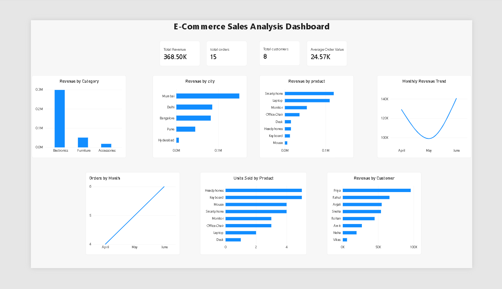

# E-Commerce Sales Analysis

## Project Overview

This project analyzes e-commerce sales data to understand revenue performance, customer behavior, product performance, and sales trends using SQL and Power BI.

## Business Questions

- What is the total revenue generated?
- Which product categories generate the most revenue?
- Which products generate the highest revenue?
- Which cities generate the most revenue?
- Which customers generate the most revenue?
- How does revenue change over time?
- Which products sell the most units?

## Tools Used

- **MySQL** – Database creation, data storage, and SQL analysis
- **Power BI** – Data visualization and dashboard creation
- **DAX** – Measures and calculations in Power BI
- **VS Code** – Project documentation

## Dataset

The project uses three MySQL tables:

- **customers** – customer details such as customer ID, name, city, and signup date
- **products** – product details such as product ID, product name, category, and price
- **orders** – order details such as order ID, customer ID, product ID, order date, and quantity

## SQL Analysis

SQL was used to analyze sales performance and answer key business questions, including:

- Total revenue by customer
- Customers with revenue above ₹50,000
- Top-selling products
- Revenue by product category
- Revenue by city
- Monthly revenue trends
- Customer performance
- Product performance
- Category revenue contribution

## Power BI Dashboard

The Power BI dashboard was created to provide a visual overview of e-commerce sales performance.

The dashboard includes:

- Total Revenue
- Total Orders
- Total Customers
- Average Order Value
- Revenue by Category
- Revenue by City
- Revenue by Product
- Monthly Revenue Trend
- Orders by Month
- Units Sold by Product
- Revenue by Customer

## Key Insights

- Electronics generated the highest share of total revenue.
- Mumbai generated the highest revenue among the cities analyzed.
- Smartphone generated the highest revenue among the products.
- Headphones and Keyboard had the highest unit sales.
- Revenue increased from May to June 2024.
- Priya generated the highest customer revenue.

## Project Files

- `ecommerce_sales_analysis.sql` – SQL database setup, sample data, and analysis queries
- `Ecommerce_Sales_Analysis.pbix` – Power BI dashboard
- `README.md` – Project documentation

 ## Dashboard

